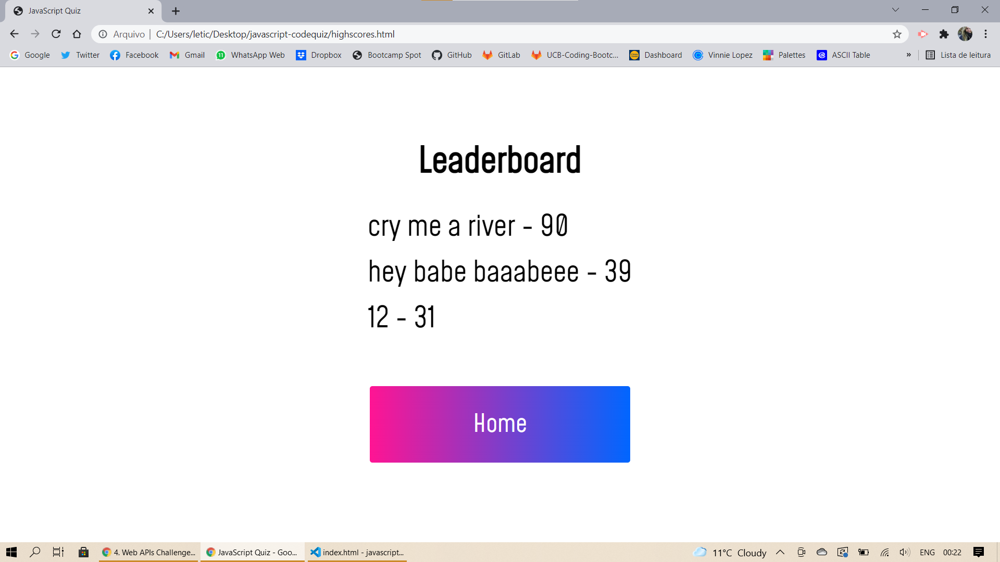

# Javascript Codequiz

This is a simple timed coding quiz with multiple -choice questions.
You have 1 minute to answer only 5 questions, but if you get it wrong, 5 seconds will be deducted from your timer counter.
At the end, you can save your score and compare it with other players.

## Application
You can try it out clicking [here](https://leticianardi.github.io/javascript-codequiz/).

## Screenshots

# Have fun!